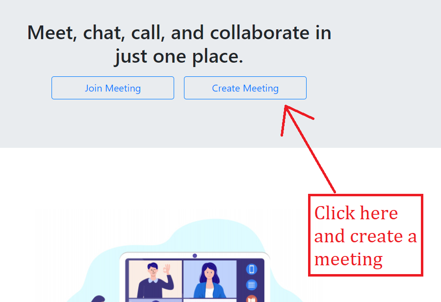
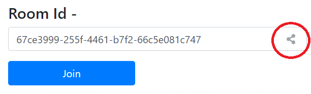
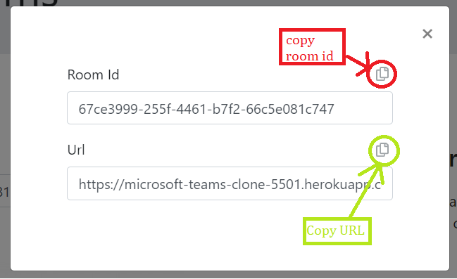
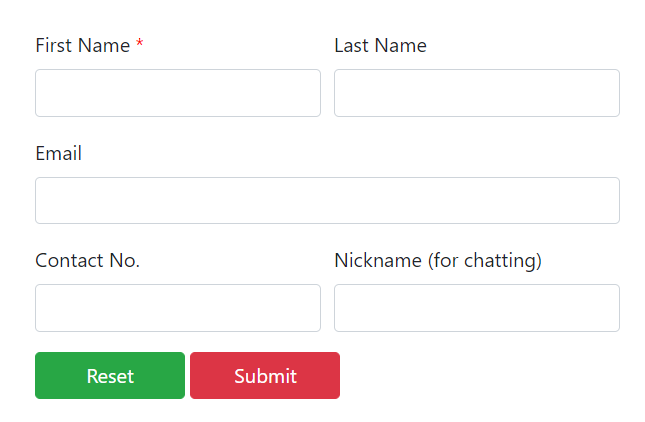
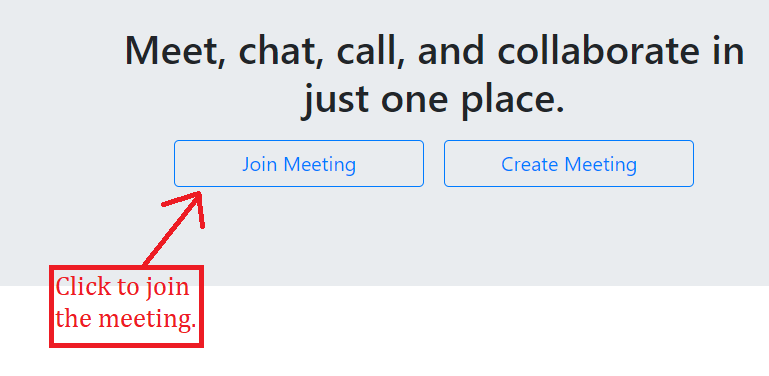
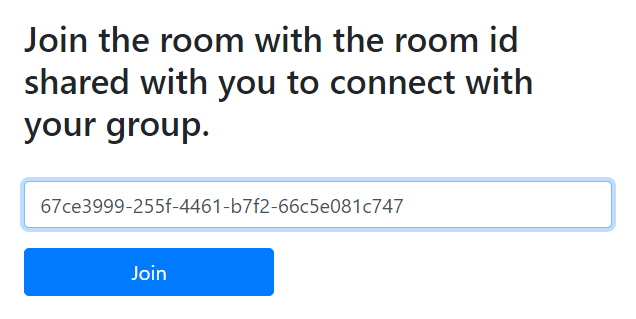

# Mircosoft-Teams-Clone

Microsoft teams clone is a video calling web application that allows users to connect with people from anywhere.
<br>
[Project link](https://microsoft-teams-clone-5501.herokuapp.com/)
<br><br>

## Features Avaiable

- Video calling with a group of maximum 10 people.
- Screen sharing with all 10 members can share their respective screens at the same time.
- Full screen size of any particular video.
- Audio/Video choice options.
- Chatting with peers.
- Participants lists present.
- White board for scribbling.

## Project Motivation

The project has been a part of the Microsoft Engage 2021 Mentorship program in which the mentees are asked to build the Microsoft Teams Clone with the mandatory functionality - a minimum of two participants should be able connect with each other and have a video conversation.

## Tech Stack
- Bootstrap
- Javascript
- Node.js
- Express.js
- PeerJS
- UUID

## Getting Started

1. Fork the repository.
 
2. Clone the forked repository.
```bash
git clone https://github.com/<your_user_name>/Microsoft-Teams_Clone.git
```

3. Navigate to the cloned repository.
```bash
cd Microsoft-Teams_Clone
```

### Prerequisite

Download Node.js from [here](https://nodejs.org/en/download/).
<br>
Verify installation by checking the version.
```bash
node -v
npm -v
```

### Installation
Install the dependencies by running the command in the terminal
```bash
npm install
```

## Usage

To start with the project run the command and go to http://localhost:3500
```bash
node app.js
```
### Host

- Click on the create meeting button.
<br><br>


- Click on the share icon to share the room id or url.
<br><br>


- Select an option of either copying room id or url.
<br><br>


- Close the box and join the meeting.
- Fill the information so that people in the meeting will know you by your name.
<br><br>


### Client

- On the home page click on the join meeting button.
<br><br>


- Paste the shared room id here and join the meeting. 
<br><br>


- Fill the form as before.
